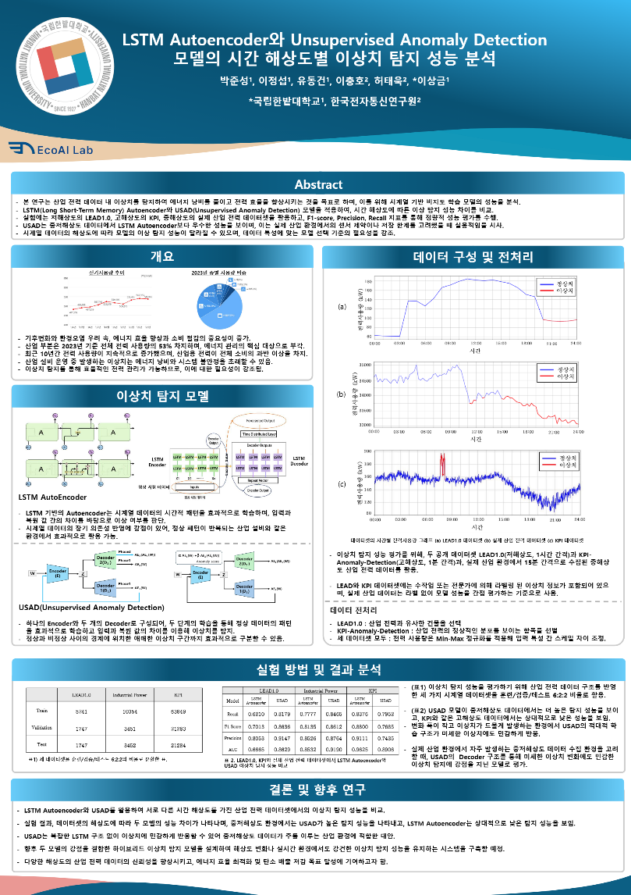

## 🔍2025년도 하계종합학술대회

1. 일시 : 2025-06-24 (화) ~ 2025-06-27 (금)
2. 장소 : 롯데호텔 제주(중문)
3. 주최 : 대한전자공학회

### 참가 내역
---
### 📌논문
  - 제목 : LSTM Autoencoder와 Unsupervised Anomaly Detection 모델의 시간 해상도별 이상치 탐지 성능 분석

